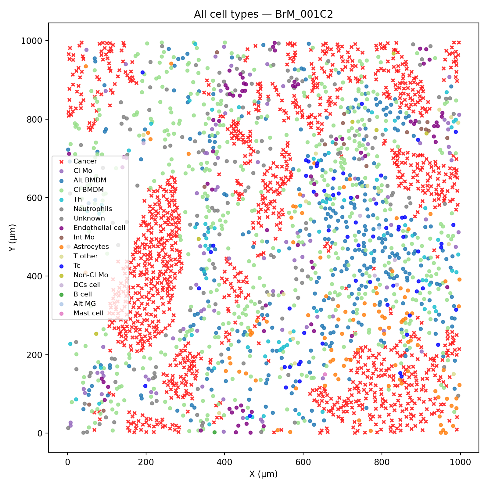
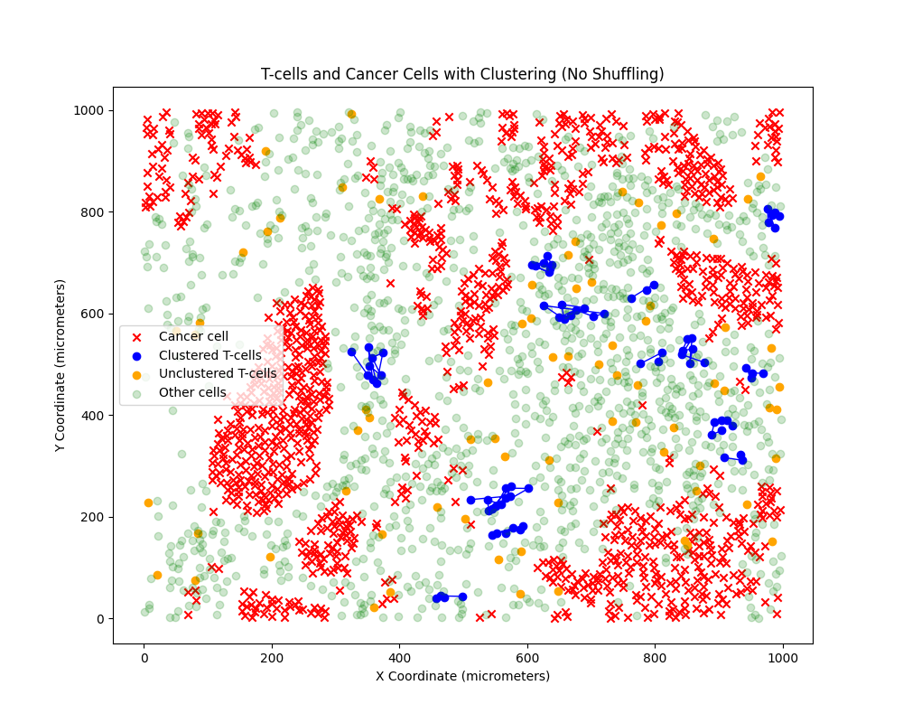
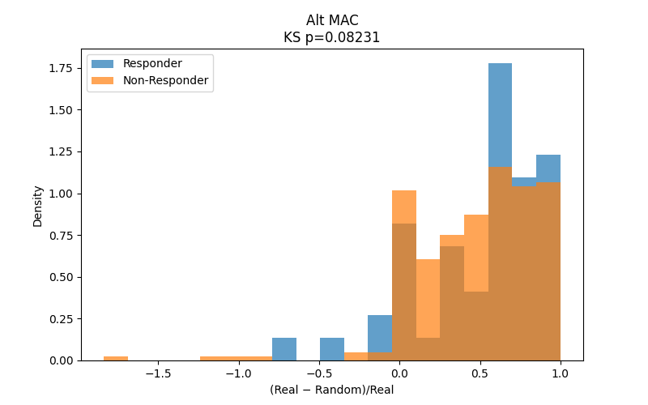

# Research @ Nationwide-Children's-Hospital
## Overview
- Research focus is on understanding how the spatial organization of immune and tumor cells within the tumor microenvironment correlates with cancer progression and treatment response
- Datasets came from published papers on high-resolution spatial single-cell imaging of brain, lung, and head/neck tumor tissues
- Developed python algorithms to map out cell slides, cluster immune cells (CD8+ cells), and perform statisitcal analysis of cluster count, responder vs non-responder, etc
- Currently drafting a research paper to be submitted to a journal

## Tools Used
- Python (PyCharm)
- Pandas, Matplotlib, Numpy, Statsmodel, Sci-Learn, Scipy.io
 
## Code Walkthrough

- Mapping out cell sides is essential to asses the structures and cell types present. Cell coordinates need to be extracted in the correct manner in order to achieve accurate results. In certain datasets such as the Brain and Lung Tumor the cell coordinates are encoded through lattice correlations (describe what lattice correlations are).

[Code for slide plotting](cellMap.py)

- Taking a deeper dive into the response of immune cells (Immune cells also go by either CD8+ or T-Cells), we cluster any immune cells within 30 μm of each other (Explain significance of clustering from paper), the plot is shown below.

- Looking into a more clinical perspective, we look at whether or not the patient has improved based off Immune Checkpoint Inhibitors, a form of immunotherapy treatment. The slides are classifed into two categories, responder or non-responder. By comparing the responses to a fencing metric, how well immune cells "fence in" or surround tumor cells in a spatial tissue sample, we can reveal whether immune cell spatial clustering around tumors is associated with a better response to immunotherapy — and may help identify spatial biomarkers of treatment success. Below is a comparison plot for Alternative Macrophage Cells.

[Code for statistcal response comparison and fencing calculations](NRvR.py)
